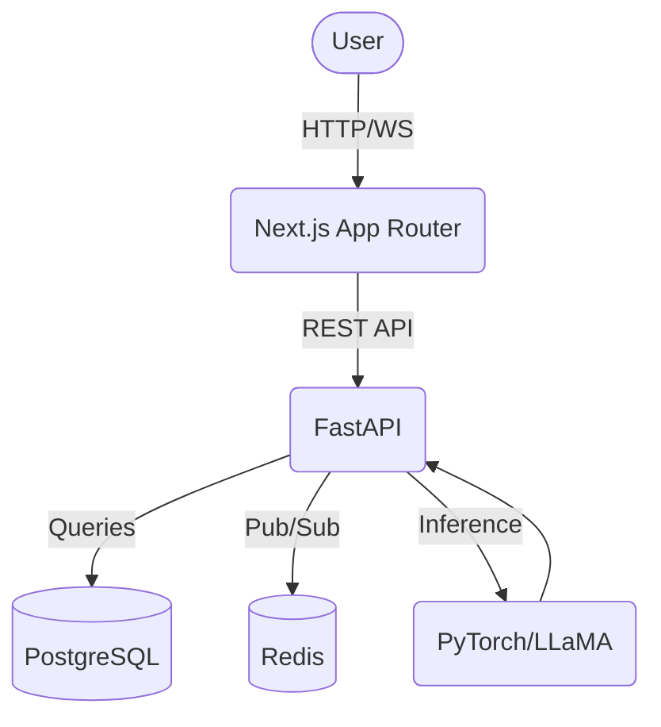

# MentalWelfare

**MentalWelfare** is an AI-powered mental health support system designed for uniformed forces personnel. It provides real-time mood analysis, risk assessment, and anonymous support with a focus on security, privacy, and proactive interventions.

## Overview

The platform uses advanced NLP techniques to analyze communications, detect early signs of mental health issues, and provide actionable insights to supervisors and mental health professionals, ensuring rapid intervention in emergency scenarios.

## Architecture



## Features

* **Security-first**: Deterministic AI risk decisions, RBAC with 5 roles.
* **Privacy-preserving**: Data minimization, IP hashing, audit logging.
* **Real-time processing**: WebSockets for immediate alerts and notifications.
* **Advanced ML**: Sentiment analysis (VADER), context understanding (DistilBERT), generated responses (LLaMA).

## Quick Start

### Local Development

1. **Clone the repository**
2. **Setup environment variables**: Copy `.env.example` to `.env` and fill in necessary values.
3. **Run using Docker Compose**:
    ```bash
    docker-compose up -d
    ```

### Manual Setup

Refer to individual README files in `frontend`, `backend`, and `ml-service` directories for detailed setup instructions.

## Directory Structure

* `frontend/`: Next.js application (React 19, Tailwind CSS, shadcn/ui)
* `backend/`: FastAPI application (SQLAlchemy, PostgreSQL/SQLite, Redis)
* `ml-service/`: Machine learning API (PyTorch, Transformers, VADER)
* `docker/`: Dockerfiles for building the services

## Environment Variables

See `.env.example` for all configurable environment variables.

## Security Overview

The platform implements rigorous security measures including:
* JWT-based authentication
* Argon2 password hashing
* strict CORS policies
* Comprehensive audit logging

## ML Pipeline

The ML pipeline is responsible for text analysis and inference. It utilizes:
* **VADER** for sentiment scoring
* **DistilBERT** for context-aware representation
* **LLaMA** for natural language generation
* **Edge-TTS** for text-to-speech
* **Whisper** for speech-to-text

## Mobile & Desktop Standalone (Option A)

For demo/hackathon purposes, the platform is compiled into fully standalone binaries:
* **MentalWelfare.exe**: A self-contained Windows application that bundles the Next.js server, Python ML backend, FFmpeg, and the database connection.
* **MentalWelfare.apk**: An Android application that connects to the laptop's MentalWelfare.exe server over the local Wi-Fi network.

### Future Scope: 100% Offline Mobile Execution
Currently, the APK requires the laptop to run the heavy Node.js, PyTorch, and PostgreSQL stack. In the future, we plan to make the mobile app run entirely locally on-device without internet or local servers by:
1. Converting the Next.js frontend into a static Capacitor Single Page Application (SPA).
2. Replacing PostgreSQL with an on-device Capacitor SQLite database.
3. Quantizing the PyTorch LLM and DistilBERT models into **TFLite** or **ONNX** formats to run natively on Android's Neural Processing Unit (NPU) using Java/Kotlin bridges.
